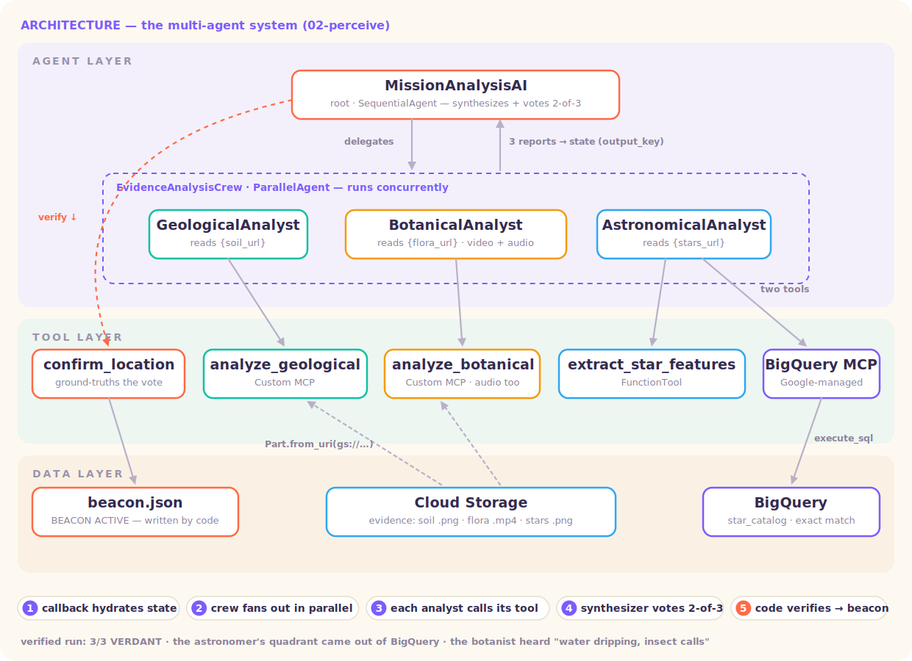
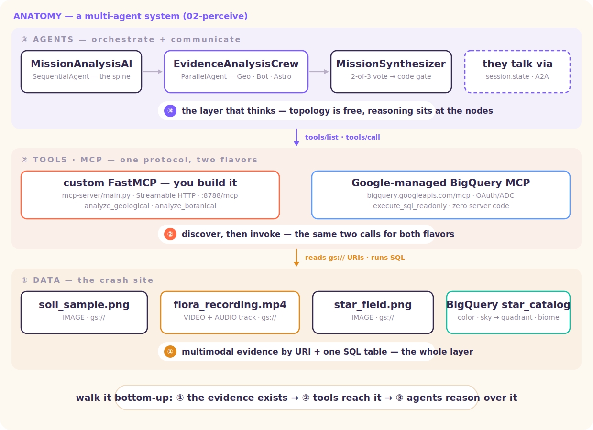

# Level 2 · Reason — the specialist crew

> One generalist can't see everything. Build a crew of specialists, run them **in parallel**, let **code** verify the answer.



A real multi-agent system (architecture follows [gca way-back-home level_1](https://github.com/gca-americas/way-back-home/tree/main/solutions/level_1)) — verified end-to-end:

```
MissionAnalysisAI (SequentialAgent)
 ├─ before_agent_callback ······· hydrates evidence URLs + coords into shared STATE
 ├─ EvidenceAnalysisCrew (ParallelAgent — true concurrent fan-out)
 │   ├─ GeologicalAnalyst ······· soil IMAGE        → custom MCP · analyze_geological
 │   ├─ BotanicalAnalyst ········ flora VIDEO+AUDIO → custom MCP · analyze_botanical
 │   └─ AstronomicalAnalyst ····· star image → local vision tool → BigQuery MCP lookup
 └─ MissionSynthesizer ·········· 2-of-3 consensus → confirm_location (deterministic gate)
```

The same system as **three layers** — data → tools (MCP) → agents (the map the session walks bottom-up):



## What makes it real

- **True multimodal evidence** — the botanist analyzes a Veo-generated **video with a native audio track** (it reported *"water dripping, insect calls"* from the soundtrack in our verification run). Evidence lives on **Cloud Storage** as `gs://` URIs; Gemini ingests it by URI inside the tools.
- **Two MCP patterns, one client wiring** (the pedagogical core):
  - [`mcp-server/`](mcp-server/) — a **custom** FastMCP server *you* author (Streamable HTTP, 2 tools), consumed via ADK `MCPToolset`.
  - the **Google-managed BigQuery MCP** (`https://bigquery.googleapis.com/mcp`) — zero server code, OAuth ADC auth; the astronomer runs `execute_sql_readonly` against a real **BigQuery** table.
- **State as the whiteboard** — the callback writes `soil_url / flora_url / stars_url / x / y` once; every sub-agent instruction reads them by `{key}` templating; analysts publish reports via `output_key` for the synthesizer.
- **Code judges** — `confirm_location` checks the crew's biome against coordinates the model never saw, and writes `outputs/beacon.json`. The gate is deterministic.

| Piece | File |
|---|---|
| Orchestration (parallel → synthesize) | [`agent/agent.py`](agent/agent.py) |
| The three specialists | [`agent/agents/`](agent/agents/) |
| Custom-MCP / BigQuery-MCP / gate tools | [`agent/tools/`](agent/tools/) |
| The custom MCP server | [`mcp-server/main.py`](mcp-server/main.py) |
| BigQuery star catalog seed | [`setup/setup_star_catalog.py`](setup/setup_star_catalog.py) |
| Evidence generator (images + Veo video → GCS) | [`generate_evidence.py`](generate_evidence.py) |
| 60-second MCP spotlight (both flavors, no crew) | [`spotlight_mcp.py`](spotlight_mcp.py) |
| State spotlight — YOUR variable through callback → state → gate | [`spotlight_state.py`](spotlight_state.py) |

## 🧭 Run it locally — step by step

Part 1 of the tutorial; Part 2 (deploying, both shapes) is the **🚀 Ship it** section below.
Each step says what to run AND what you should see.

**Step 0 — prerequisites.** A GCP project with billing, ADC logged in
(`gcloud auth application-default login`), and the Vertex AI + BigQuery APIs enabled.

```bash
# copy the env template, then edit it: set GOOGLE_CLOUD_PROJECT
cp .env.example .env
uv sync
```

**Step 1 — seed the BigQuery star catalog (one-time).**

```bash
uv run python setup/setup_star_catalog.py
```

> **What to expect:** dataset `multimodal_levels`, table `star_catalog`, 12 rows of
> enum-constrained vocabulary (star colors × sky conditions → biome + quadrant). The astronomer
> will later match against these EXACT values — that's why its vision tool is enum-constrained.
>
> **Cost:** lookups scan KBs (BigQuery bills a 10 MB minimum per on-demand query) — effectively
> $0 at any workshop scale, inside the monthly free tier. **Verify the seed:**
> `bq query --use_legacy_sql=false 'SELECT COUNT(*) FROM `multimodal_levels.star_catalog`'`

**Step 2 — start the custom MCP server.**

```bash
# → http://localhost:8788/mcp
cd mcp-server && uv run python main.py &
cd ..
```

> **What to expect:** a uvicorn line on :8788. This is MCP pattern #1 — a FastMCP server YOU
> author (2 tools: `analyze_geological`, `analyze_botanical`). Pattern #2 needs no server at
> all: the astronomer hits Google's MANAGED BigQuery MCP endpoint directly.

**Step 3 — generate the crash-site evidence (~2–4 min; Veo is the slow part · billed).**

```bash
uv run python generate_evidence.py --biome verdant
```

> **What to expect:** three artifacts in GCS (`soil_sample.png`, `flora_recording.mp4` with a
> native AUDIO track, `star_field.png`) + `evidence/manifest.json` holding the `gs://` URIs and
> the secret crash coordinates. The images come from ONE chat session (Level 1's trick, reused);
> the flora video comes from Veo.

**Step 4 — run the mission: parallel crew → consensus → gate.**

```bash
uv run python run_mission.py
```

> **What to expect (verified run):** three report lines arriving as the parallel fan-out
> completes —
> `GEOLOGICAL ANALYSIS: VERDANT (confidence: 98%) …` ·
> `BOTANICAL ANALYSIS: VERDANT … · water dripping, insect calls` (the botanist heard the
> video's AUDIO track through the MCP server) ·
> `ASTRONOMICAL ANALYSIS: VERDANT (quadrant SW) …` (that biome came out of BigQuery, not the
> model's imagination) — then the synthesizer applies 2-of-3 and the code gate writes
> `outputs/beacon.json` → **BEACON ACTIVATED**. Try `--biome volcanic` to regenerate the whole
> site elsewhere and watch the same pipeline conclude differently.

**Step 4b (alternative) — the same mission, interactively in the ADK dev UI.**

```bash
# → http://localhost:8000 — pick `agent` in the top-left dropdown
#   (`a2a_crew` also appears — that's the Shape-2 dispatcher; it
#    needs the A2A fleet from the 🚀 Ship-it section running)
uv run adk web
```

Then send the same message the script sends:
*"Analyze all crash-site evidence and confirm my location. Activate the beacon."*

> **What to expect:** the same run, but *visible*. The **Events** panel shows the three analysts
> fanning out concurrently, every MCP `tools/call` (both the FastMCP server and BigQuery), and
> the **State** tab shows the whiteboard filling up — the callback's `soil_url / flora_url /
> stars_url / x / y`, then each analyst's `output_key` report landing before the synthesizer
> reads them. Fastest way to *see* the architecture instead of inferring it from log lines.
> Steps 1–3 are still prerequisites (catalog seeded, MCP server up, evidence generated); if
> :8000 is taken, `uv run adk web --port 8080`.

**Step 5 (optional) — the 60-second MCP spotlight.** The tool layer alone, no crew:

```bash
uv run python spotlight_mcp.py
```

> **What to expect:** the same client speaks the same three verbs — `initialize → tools/list →
> tools/call` — against BOTH servers. Act ①: your FastMCP answers `analyze_geological` on the
> soil evidence (a real Gemini call). Act ②: Google's managed BigQuery MCP runs
> `execute_sql_readonly` and the catalog row comes back
> (`red_orange · ash_dimmed → NE · VOLCANIC`). The only difference between the acts is who
> runs the server. Point act ① at a deployed analyzer with `MCP_SERVER_URL=…`
> (+ `WORKSHOP_TOKEN=…` if that deploy is gated).

**Step 6 (optional) — watch YOUR variable travel: callback → state → instruction → gate.**

```bash
# or run it bare and type the numbers when prompted
uv run python spotlight_state.py --x 25 --y 25
```

> **What to expect:** the state machinery, made touchable — with YOUR values. ① a
> `before_agent_callback` writes the evidence URLs **and the coordinates you typed** into
> session state, once; ② the Geologist's instruction is printed verbatim — it contains a
> LITERAL `{soil_url}` (nobody pasted a URL) — then shown resolved, because ADK reads state at
> runtime; ③ the real Geologist runs (real MCP tool call) and its report lands **back in
> state** via `output_key` — the whiteboard round-trip; ④ `confirm_location`'s math runs on
> YOUR coordinates. Now rerun with `--x 75 --y 75`: quadrant NE = VOLCANIC ground truth, the
> model still says VERDANT → **✗ MISMATCH — the gate sides with your variable over the model.**
> That's "code judges" in one line of output.

**Troubleshooting:**

| Symptom | Fix |
|---|---|
| astronomer says INCONCLUSIVE | Step 1 not run (no catalog), or BigQuery API/IAM missing |
| analysts report `NOT AVAILABLE — run generate_evidence.py first` | Step 3 not run — no manifest |
| MCP tool calls hang | Step 2 server not up, or `MCP_SERVER_URL` points somewhere stale |
| `429` during evidence gen | image quota is 2/min — the script throttles, but a rerun right after a run can trip it |

## The simpler on-ramps

- [`adk-basics/`](adk-basics/) *(if present)* / [`src/`](src/) — the original TypeScript "two ways of seeing" primitive (`read` + `measure` + `Promise.all` fan-out), still runnable with `npm install && npm run roster`. Read it first if the full system feels like a lot — it's the same shape, minus the infrastructure.

---

## 🚀 Ship it — one crew, two shapes

> The deep tutorial behind the **⌁ Launch Bay** in the Way Back Home realm. The same crew can
> ship as **one service** (the monolith) or as **independent A2A services** — the orchestration
> tree barely changes; the *hosting* does. Everything marked ✔ was verified end-to-end on a
> real project before this section was written.

```
SHAPE 1 · MONOLITH (one craft)             SHAPE 2 · A2A (a fleet)
MissionAnalysisAI ── Cloud Run svc 1       Dispatcher (your laptop or svc 1)
 ├─ ParallelAgent — in-process fan-out       ├─ card → RemoteA2aAgent · Geological   svc 2
 │   ├─ Geological ├─ Botanical              ├─ card → RemoteA2aAgent · Botanical    svc 3
 │   └─ Astronomical                         └─ card → RemoteA2aAgent · Astronomical svc 4
 └─ shared session STATE (whiteboard)      evidence travels IN THE MESSAGE
custom MCP server ── Cloud Run svc 2       custom MCP server ─────────── svc 5
```

### When to pick which (the heuristic worth memorizing)

**Split on ownership and scaling boundaries — not on module boundaries.**

| Signal | Shape |
|---|---|
| one team owns all three analysts, ships them together | monolith |
| latency matters most (in-process fan-out, no network hops) | monolith |
| one analyst needs a GPU / another framework / its own release cadence | A2A |
| different teams (or companies!) own different specialists | A2A |
| you're at 3 agents and wondering — | monolith until it hurts |

The parallel fan-out already gives you concurrency in BOTH shapes — `ParallelAgent` runs the
three analysts concurrently whether they're objects in one process or services on three hosts.

> **MCP vs A2A — don't mix them up.** This level already runs a remote *MCP* server (the
> Location Analyzer): that's **agent → tool**. A2A is **agent → agent** — the dispatcher
> delegates a whole task to a peer that reasons for itself. Level 3 (Open Channels) hand-rolls
> the A2A card to show you the protocol's guts; here we use ADK's native support.

### Step 0 — prerequisites

Same as the local run at the top of this README: `.env` with your project, ADC
(`gcloud auth application-default login`), the star catalog seeded
(`uv run python setup/setup_star_catalog.py`), and evidence generated
(`uv run python generate_evidence.py --biome verdant` → `evidence/manifest.json` + GCS uploads).

### Shape 1 — the monolith on Cloud Run

**1a · Deploy the custom MCP server first** (the analysts need it; it has its own Dockerfile):

```bash
gcloud run deploy location-analyzer \
  --source mcp-server --region us-central1 --allow-unauthenticated
# → https://location-analyzer-XXXXXXXX.us-central1.run.app
```

**1b · Deploy the crew as ONE service**, pointing it at the MCP URL:

```bash
uv run adk deploy cloud_run \
  --project $(gcloud config get-value project) \
  --region us-central1 \
  --service_name mission-crew \
  --with_ui \
  agent \
  -- --set-env-vars MCP_SERVER_URL=https://location-analyzer-XXXXXXXX.us-central1.run.app
```

(Everything after `--` is passed straight to `gcloud run deploy` — that's how you set env vars,
`--max-instances`, or `--no-allow-unauthenticated`.)

**1c · Grant the service Vertex + BigQuery access** (the astronomer queries BigQuery, everything
calls Gemini — deployed code authenticates as the *service account*, not you):

```bash
PROJECT=$(gcloud config get-value project)
SA=$(gcloud run services describe mission-crew --region us-central1 --format 'value(spec.template.spec.serviceAccountName)')
gcloud projects add-iam-policy-binding $PROJECT --member serviceAccount:$SA --role roles/aiplatform.user
gcloud projects add-iam-policy-binding $PROJECT --member serviceAccount:$SA --role roles/bigquery.jobUser
gcloud projects add-iam-policy-binding $PROJECT --member serviceAccount:$SA --role roles/bigquery.dataViewer
```

**1d · Smoke it** — open the service URL (`--with_ui` serves the ADK dev UI), pick `agent`, and
send: *"Analyze all crash-site evidence and confirm my location."* One blast radius, one URL,
one thing to redeploy.

### Shape 2 — the A2A fleet ✔

The variant lives in [`a2a_crew/`](a2a_crew/) — read the three files in order:
[`analysts.py`](a2a_crew/analysts.py) (same tools, re-instructed for remote life),
[`serve_analyst.py`](a2a_crew/serve_analyst.py) (one entrypoint = any specialist),
[`agent.py`](a2a_crew/agent.py) (the dispatcher: `ParallelAgent` of three `RemoteA2aAgent`s).

**What actually changed from the monolith — the whole lesson in two bullets:**
- **State does not travel.** The monolith's callback wrote `soil_url/flora_url/stars_url` into
  shared state; analysts read it by `{key}` templating. A remote service never sees your
  session state — so the evidence manifest rides **in the message**, and each specialist
  extracts its own line. (`run_mission_a2a.py` builds that message.)
- **`output_key` doesn't cross the wire.** The synthesizer reads the three reports from the
  conversation instead of state templating. Everything else — tools, the deterministic
  `confirm_location` gate, the 2-of-3 protocol — is untouched.

**2a · Install the A2A extra** (once):

```bash
uv sync --extra a2a
```

**2b · Run the fleet locally first ✔** — three services + your dispatcher, four terminals
(or `&` them):

```bash
# ports: geological :8791 · botanical :8792 · astronomical :8793
ANALYST=geological   uv run python -m a2a_crew.serve_analyst &
ANALYST=botanical    uv run python -m a2a_crew.serve_analyst &
ANALYST=astronomical uv run python -m a2a_crew.serve_analyst &
```

Each service publishes its **Agent Card** — the discovery contract a caller binds to instead of
your code. Look at one (note: ADK's well-known path is `agent-card.json`; Level 3's hand-rolled
server uses the older `agent.json`):

```bash
curl -s http://localhost:8791/.well-known/agent-card.json | python3 -m json.tool | head
```

Then run the mission — same question, remote crew, same code gate:

```bash
uv run python -m a2a_crew.run_mission_a2a
```

Verified run: all three REMOTE analysts returned VERDANT (the astronomer's biome came out of
BigQuery, quadrant SW; the botanist reported the video's *audio* cues through the MCP server),
the synthesizer applied 2-of-3, and `confirm_location` wrote `outputs/beacon.json` →
**BEACON ACTIVATED**. The tree didn't change; the hosting did.

**2c · Deploy the fleet to Cloud Run** — one image, three deployments. The repo root
[`Dockerfile`](Dockerfile) builds the analyst service; `ANALYST` picks the specialist:

```bash
PROJECT=$(gcloud config get-value project)
MCP_URL=https://location-analyzer-XXXXXXXX.us-central1.run.app

for A in geological botanical astronomical; do
  gcloud run deploy $A-analyst \
    --source . --region us-central1 --allow-unauthenticated \
    --set-env-vars ANALYST=$A,MCP_SERVER_URL=$MCP_URL,GOOGLE_CLOUD_PROJECT=$PROJECT,GOOGLE_CLOUD_LOCATION=us-central1,GOOGLE_GENAI_USE_VERTEXAI=True
done
```

Grant each service's account `roles/aiplatform.user` (+ `bigquery.jobUser` and
`bigquery.dataViewer` for the astronomer) exactly as in 1c. `--allow-unauthenticated` keeps the
workshop simple; the production move is service-to-service ID tokens instead.

**2d · Point the dispatcher at the fleet** — the dispatcher discovers each analyst by URL; the
demo moment is your *laptop* orchestrating three cloud services:

```bash
GEO_ANALYST_URL=https://geological-analyst-XXXX.us-central1.run.app \
BOT_ANALYST_URL=https://botanical-analyst-XXXX.us-central1.run.app \
ASTRO_ANALYST_URL=https://astronomical-analyst-XXXX.us-central1.run.app \
uv run python -m a2a_crew.run_mission_a2a
```

Swap one analyst's URL for a teammate's deployment and the mission still runs — **that's the
Agent Card doing its job**: the dispatcher binds to `{name, skills, endpoint}`, never to code.
(Hosting the dispatcher itself as a fourth service follows the same Dockerfile pattern —
boss-level exercise.)

### The delta list (what flipping the toggle really costs)

| | Monolith | A2A fleet |
|---|---|---|
| URLs to manage | 1 | 4 (5 with the MCP server) |
| State | shared session whiteboard | explicit message payloads |
| `sub_agents=` | `[geo, bot, astro]` | `[RemoteA2aAgent × 3]` |
| Blast radius | one deploy, all-or-nothing | independent deploys + scaling |
| New failure modes | — | cold starts · inter-service auth · tracing across hops |

### Troubleshooting

| Symptom | Cause → fix |
|---|---|
| `ModuleNotFoundError: a2a.client` running the dispatcher | the extra isn't installed → `uv sync --extra a2a` |
| Analyst service starts, mission hangs at fan-out | wrong card URL — check `curl $URL/.well-known/agent-card.json` returns the analyst's name |
| `ASTRONOMICAL ANALYSIS: INCONCLUSIVE` | the star catalog isn't seeded in *the service's* project → run `setup/setup_star_catalog.py` against it, and check BigQuery IAM (1c) |
| Analysts report `NOT AVAILABLE — run generate_evidence.py` | (monolith only) `evidence/manifest.json` missing — generate evidence first |
| MCP tool calls fail from deployed analysts | `MCP_SERVER_URL` unset on the service, or the MCP server requires a token the analyst isn't sending |
