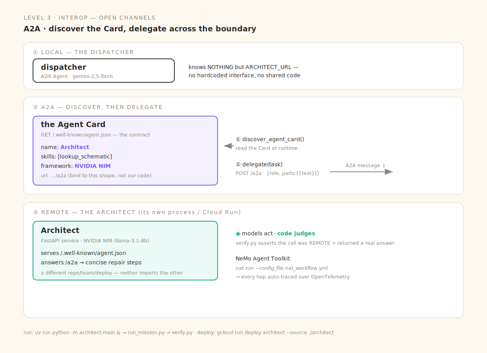

# Level 3 · Interop — Open Channels

> Then you hit a wall: `sub_agents` reach only the same process. A2A lets a dispatcher **discover** a remote agent by its Card and **delegate** — no hardcoded interface, no shared code.



Real, runnable code for every beat of the session (deck: *Way Back Home · D1·S3 — Interoperability & Orchestration*). The remote **Architect** runs on NVIDIA **NIM**; **NeMo Agent Toolkit** gives it a declarative, auto-traced workflow.

| Slide beat | Code | The one idea |
|---|---|---|
| ① In-process crews hardcode addresses | *(the wall)* | `sub_agents` reach only the same process; a hardcoded URL dict breaks at agent #5 |
| ② The Agent Card is the contract | [`architect/main.py`](architect/main.py) · `/.well-known/agent.json` | a caller binds to `{name, url, skills, framework}` — not to your code |
| ③ Discover, don't hardcode | [`agent/tools/a2a_tools.py`](agent/tools/a2a_tools.py) · `discover_agent_card` | read the Card at its well-known URL **at runtime** |
| ④ Delegate across the boundary | `a2a_tools.py` · `delegate` | an A2A message to the endpoint the Card names — NIM behind it, but you only speak A2A |
| ⑤ Declare + observe | [`nat_workflow.yml`](nat_workflow.yml) | **NeMo Agent Toolkit** runs the agent declaratively; every hop auto-traced over OpenTelemetry |
| ⑥ Code judges | [`verify.py`](verify.py) | the gate asserts the call was **remote** and returned a real answer |

## Run it locally

```bash
cp .env.example .env          # GOOGLE_CLOUD_PROJECT (Vertex/ADC) · NVIDIA_API_KEY
uv sync

# ① start the remote Architect — its OWN process (its own repo/host in real life):
uv run python -m architect.main &     # → :8790 · serves /.well-known/agent.json + /a2a (NIM)

uv run python run_mission.py          # the dispatcher discovers the Card → delegates → answer
uv run python verify.py               # the gate (remote=true)
# interactive: uv run adk run agent   /   uv run adk web
```

Deploy the Architect to its **own** Cloud Run host for a true cross-boundary demo — the dispatcher never changes:

```bash
gcloud run deploy architect --source ./architect --region us-central1 --allow-unauthenticated \
  --set-env-vars NVIDIA_API_KEY=$NVIDIA_API_KEY
# then set ARCHITECT_URL to its URL.
```

## NeMo Agent Toolkit

`nat run --config_file nat_workflow.yml` runs the same ReAct agent declaratively and **auto-instruments every LLM + tool call over OpenTelemetry** — zero tracing code. Your spans and latencies vary by project; the *instrumentation* is automatic, not the numbers.

## The wall → the fix

`sub_agents=[...]` is great until agent #5 lives in another repo, team, or deploy. The Agent Card + A2A is the seam: **discover** capabilities at runtime, **delegate** over a framework-agnostic message. The Architect is NIM, the dispatcher is Gemini — neither imports the other.
