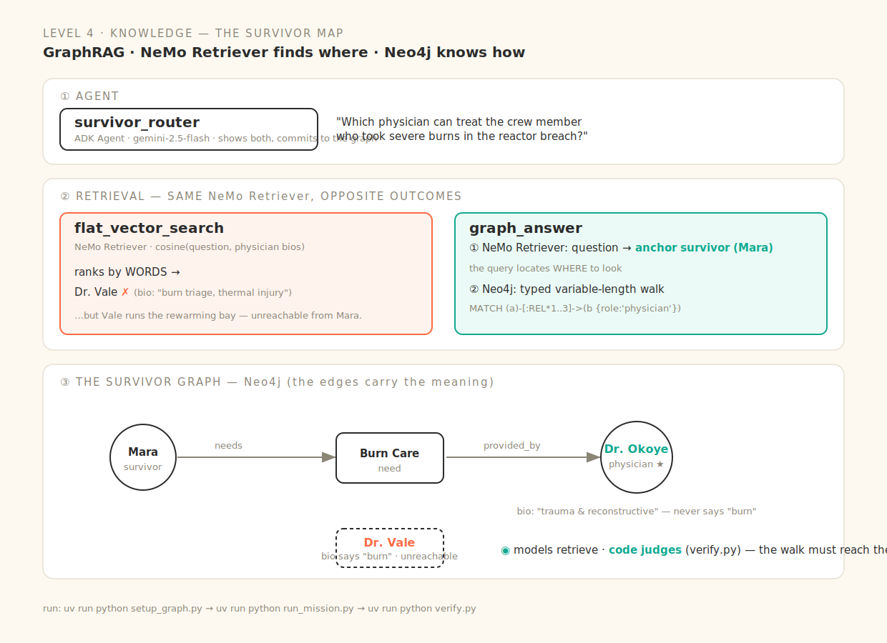

# Level 4 · Knowledge — the Survivor Map

> Embeddings find *where to look*; the graph knows *how things connect*. Flat similarity ranks by words and picks the wrong medic — the typed walk follows the edges to the right one.



Real, runnable code for every beat of the session (deck: *Way Back Home · D1·S4 — Knowledge Graphs & GraphRAG*). NVIDIA **NeMo Retriever** for the embeddings, a real **Neo4j** variable-length Cypher walk for the graph.

| Slide beat | Code | The one idea |
|---|---|---|
| ① Beyond vector search | [`agent/tools/graph_tools.py`](agent/tools/graph_tools.py) → `flat_vector_search` | flat similarity (**NeMo Retriever**) ranks by **words** → it surfaces Dr. Vale, whose bio echoes "burn triage" — the *wrong* medic |
| ② Embeddings find *where to look* | `graph_answer` (NeMo Retriever) | the query embedding locates the **survivor** the question is about (Mara) — semantic, not keyword |
| ③ The graph knows *how things connect* | `graph_answer` (Cypher) | a real typed walk `(mara)-[:needs]->(burn-care)-[:provided_by]->(okoye)` — Okoye's bio never says "burn"; the **edges** carry the meaning |
| ④ The walk is one query | `WALK_CYPHER` | `MATCH path = (a)-[:REL*1..3]->(b:Entity {role:'physician'}) … ORDER BY length(path) LIMIT 1` |
| ⑤ Models retrieve, **code judges** | [`verify.py`](verify.py) | the gate ground-truths that the walk reached the right physician **through the edges** — never the model's opinion |
| ⑥ Seed the graph | [`setup_graph.py`](setup_graph.py) | the survivor network `MERGE`d into real Neo4j (idempotent) |

## Run it locally

```bash
# copy, then edit .env — GOOGLE_CLOUD_PROJECT (Vertex/ADC) · NVIDIA_API_KEY · NEO4J_*
cp .env.example .env
uv sync

# a real Neo4j (or point NEO4J_URI at Aura):
docker run -d --name neo4j -p 7687:7687 -p 7474:7474 -e NEO4J_AUTH=neo4j/survivornet neo4j:5

# ① seed the survivor network into Neo4j (one-time, idempotent)
uv run python setup_graph.py
# ② the mission: flat-vector fails → the graph walk finds the medic
uv run python run_mission.py
# ③ the deterministic gate
uv run python verify.py
# interactive: uv run adk run agent   /   uv run adk web
```

## Why the graph wins (slide — "her bio never says burns")

Dr. **Okoye** treats Mara's burns, but her bio reads *"trauma and reconstructive-tissue specialist"* — no "burn." Dr. **Vale**'s bio *screams* "burn triage, thermal injury," so **flat vector search ranks Vale #1** — yet Vale runs the rewarming bay and is unreachable from Mara. **Similarity misleads; the typed walk (`needs → provided_by`) corrects.** NeMo Retriever still earns its place: it finds *which survivor* the question is about (the anchor), then the graph does the connecting.

## The two halves, one answer

- **NeMo Retriever (nv-embedqa-e5-v5)** — asymmetric query/passage embeddings, 1024-dim. Great at *where to look*.
- **Neo4j typed walk** — a directed variable-length path over `[:REL {type}]` edges. The only thing that knows *how things connect*.

Same graph runs on **Spanner Graph (GQL)** if you prefer a managed planet-scale DB — the walk is the same shape.
