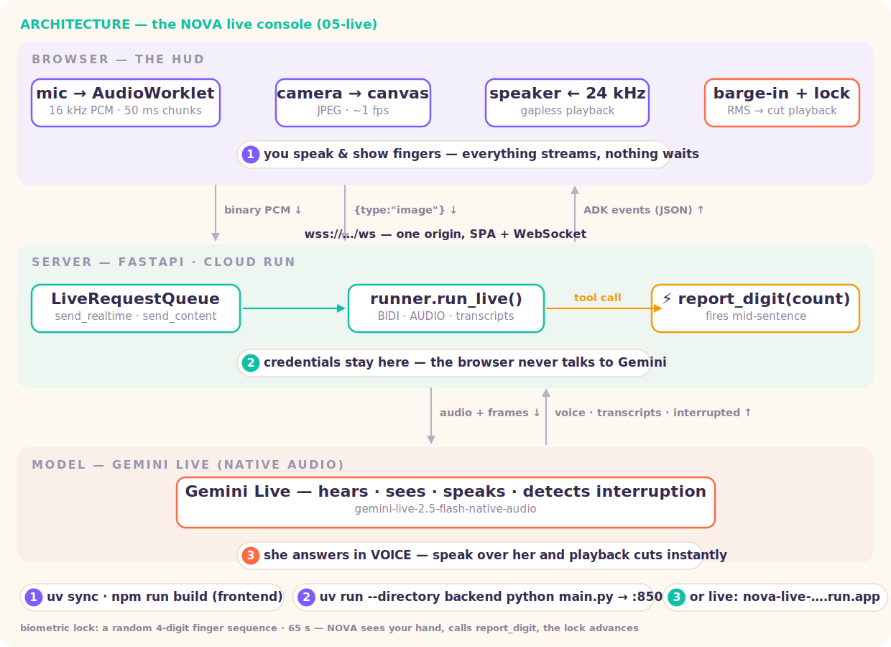

# Level 5 · Live — the NOVA voice console

> Eyes and ears on the craft. A real bidirectional voice app: **speak to NOVA, she speaks back** — and she watches the camera for the neural-sync handshake.



**▶ Try it live:** https://nova-live-680476413759.us-central1.run.app — open, INITIATE NEURAL SYNC, allow mic+camera, hold up fingers.

A standalone live-voice web app:

```
browser ──(mic 16 kHz PCM · camera JPEG frames)──►  FastAPI /ws  ──►  ADK run_live ──► Gemini Live
        ◄──(voice 24 kHz PCM · transcripts · ⚡tool calls)──┘        (native audio)
```

| Piece | File | The idea |
|---|---|---|
| Live agent | [`backend/agent/agent.py`](backend/agent/agent.py) | NOVA: native-audio `Agent` + a server-side `report_digit` tool she calls when she *sees* your fingers |
| WS bridge | [`backend/main.py`](backend/main.py) | `run_live` + `LiveRequestQueue` + `RunConfig(BIDI, AUDIO, transcriptions, proactivity)` — credentials never reach the browser |
| Mic capture | [`frontend/public/pcm-processor.js`](frontend/public/pcm-processor.js) | AudioWorklet: resample → **16 kHz** Int16, 50 ms chunks, RMS speech gate |
| Voice playback | [`frontend/src/audio.js`](frontend/src/audio.js) | **24 kHz** PCM scheduled gaplessly at `nextPlayTime` |
| **Barge-in** | both | your speech onset (RMS ≥ 0.012) instantly cuts NOVA's playback; the server also forwards `interrupted` |
| Console UI | [`frontend/src/App.jsx`](frontend/src/App.jsx) | the orb, live transcript, biometric badge, camera preview |

## 🧭 Run it locally — step by step

Part 1 of the tutorial; Part 2 (deploying it, three ways) is the **🚀 Ship it** section below.

**Step 0 — prerequisites.** A GCP project with billing + ADC
(`gcloud auth application-default login`), Vertex AI API enabled, Node 20+, and a mic + camera.

**Step 1 — install and build the SPA (one-time).** Copy the env template, then
edit `.env` and set `GOOGLE_CLOUD_PROJECT`:

```bash
cp .env.example .env
uv sync
cd frontend && npm install && npm run build && cd ..
```

> **What to expect:** `frontend/dist/` appears — the built console the backend will serve.

**Step 2 — start the backend (SPA + WebSocket bridge, one origin).**

```bash
uv run --directory backend python main.py --port 8500
```

> **What to expect:** a uvicorn line on :8500. One process now serves the UI AND the `/ws`
> bridge — the browser never talks to Gemini directly (credentials stay server-side; that's
> the whole point of the bridge).

**Step 3 — prove the stream.** Open **http://localhost:8500**, click **▶ OPEN LIVE CHANNEL**,
allow mic + camera, then run the three checks:

| Do this | What to expect |
|---|---|
| talk | NOVA answers in **voice** — the orb pulses with her actual output spectrum |
| **hold up 1–5 fingers** | she calls the `report_digit` tool server-side; the biometric badge lights; she confirms out loud |
| **speak over her** | her playback cuts **instantly** (client RMS barge-in at 0.012; Gemini also detects it server-side) |

All three green = the full contract works: mic 16 kHz up · voice 24 kHz down · interruption
both ways. These are exactly what you'll re-check after deploying (Ship it, step A3).

Frontend dev loop: `cd frontend && npm run dev` → http://localhost:5510 (proxies `/ws` + `/api` to :8500).

**Troubleshooting:**

| Symptom | Fix |
|---|---|
| nothing on http://localhost:8500 | run Step 2 from `05-live/` — its startup line prints the URL to open. `Address already in use` → rerun with `--port 8600`. A `frontend/dist` error → do Step 1's build first |
| silence after OPEN LIVE CHANNEL | mic permission denied, or `PERMISSION_DENIED: aiplatform` in the backend log (redo Step 0 auth) |
| chipmunk / slow-motion voice | a sample-rate got changed — mic path must be 16 kHz, playback 24 kHz |
| finger badge never lights | camera permission, or the camera preview is black (another app holds it) |

## 🧪 The exercise ladder — go deeper, headless

Four hands-on exercises (in [`exercises/`](exercises/)) that climb from "I talked to a
live agent" to "I know why production live agents stall, and how to fix it." They use
the SAME model and `.env` as the app above — E2–E4 run **headless**: no mic, no
browser, just timestamps and transcripts, so every claim here is checkable in your
terminal.

| # | File | You prove | Time |
|---|---|---|---|
| **E1** | `exercises/e1_adk_web/` | a live agent needs **zero frontend** — `adk web` is the bridge | ~5 min |
| **E2** | `exercises/e2_queue_lab.py` + `e2_raw_sdk.py` | the **LiveRequestQueue** contract, and what raw `google-genai` leaves you holding | ~5 min |
| **E3** | `exercises/e3_stall_clinic.py` | why a slow tool **kills the conversation** — and 3 cures, measured | ~10 min |
| **E4** | `exercises/e4_memory.py` | what a live session **remembers** — socket → session → restart → long-term | ~10 min |

Setup is the same as Run-it-locally (`.env` with your project, `uv sync`).
Every exercise runs from the level root the same way, e.g.:

```bash
uv run python exercises/e2_queue_lab.py
```

> ✂️ All command blocks in this README are comment-free on purpose — pasting
> `# comments` into a default interactive zsh throws
> `export: not valid in this context` / `unknown file attribute` errors.
> (If you want paste-able comments in your own shell: `setopt interactive_comments`.)

### E1 — NOVA in the ADK dev UI (`adk web`)

Before you build a single line of frontend, ADK will hand you one. The folder
`exercises/e1_adk_web/nova_live/` is a complete live agent — the same NOVA persona and
`report_digit` tool as the main app.

The `SSL_CERT_FILE` export is required for voice/video in the dev UI:

```bash
cd exercises/e1_adk_web
export SSL_CERT_FILE=$(uv run python -m certifi)
uv run adk web --port 8600
```

Open **http://localhost:8600**, pick `nova_live`, and:

1. **Press the 📞 call button** (next to the message box), allow the mic, and
   **say hello — you speak first.** On a fresh session NOVA waits for you, and
   the backend log stopping at `Trying to connect to live model …` is the
   *success* state — nothing more is logged until events flow.
   **→ what you learn:** `adk web` is already a complete live frontend — mic
   capture, playback, the WebSocket bridge — before you write any UI.
2. **Keep talking.** Interrupt her mid-sentence, then ask her to check
   `ship_status` and watch the tool fire in your terminal.
   **→ what you learn:** barge-in and server-side tool calls are *protocol
   features* of the live channel, not frontend tricks you have to build.
3. Open the **Events** tab and inspect what the voice turn left behind —
   transcriptions, tool calls, `turn_complete`.
   **→ what you learn:** a voice conversation is made of ordinary, inspectable
   ADK events — the same ones you'll read headless in E2.

> ⚠️ **Don't type — call.** The chat box sends typed messages through
> `generateContent`, and `gemini-live-2.5-flash-native-audio` is a
> **live-only** model, so typing gets
> `400 INVALID_ARGUMENT … not supported in the generateContent API` — even
> while a call is active (verified on ADK 2.4.0). That error is not your setup;
> it's the gap between the two APIs, and it's exactly the boundary E2 measures.
> Typed turns against the live API itself work fine — that's `e2_queue_lab.py`.

> 🔇 **Call opens but total silence?** Two causes, no error message for either:
> **you haven't spoken yet** — on a fresh session she won't go first — or the
> browser never actually got the mic (check the address-bar mic icon; a muted
> mic fails silently on both sides). Bonus wrinkle: if the session already
> holds earlier messages, `run_live` *replays them* into the new connection and
> she may greet you off those — that's session replay, the same mechanism you'll
> measure in E4 Act 1.

> The dev UI is doing everything `backend/main.py` does by hand: capturing
> mic PCM, pushing it into a `LiveRequestQueue`, playing the audio events back.
> That's the whole point — see the machine before building the machine.

### E2 — the queue contract (ADK) vs a bare socket (raw SDK)

**E2a** (`e2_queue_lab.py`) answers one question: **with no browser and no mic
in the way, what IS a live conversation, in code?** Not memory, not tools —
just the wire contract: what your app pushes *up* (the queue's three verbs) and
what rains back *down* (the event stream). Two typed turns, every event
timestamped. It's the dress rehearsal for reading `backend/main.py` — the real
app is these same twenty lines with a mic bolted on.

```bash
uv run python exercises/e2_queue_lab.py
```

1. **Watch the first turn stream in.** After `⌨️ send_content`, words trickle in
   as `🗣 transcript (partial)` lines while an audio byte-counter climbs.
   **→ what you learn:** a live reply is not a response object — it's **two
   parallel streams**: the words arrive as transcription events, the voice
   arrives separately as PCM bytes, and your app reads both as they flow.
2. **Find `✔ turn_complete`.** Only when that event lands does the lab push
   turn 2 into the queue.
   **→ what you learn:** turn-taking on a live channel is **event-driven** —
   "the model is done" is an event you react to, not a return value you await.
3. **Read the closing banner.** Total PCM ÷ 48,000 ≈ seconds of NOVA's voice
   you never played.
   **→ what you learn:** the audio flowed whether or not anyone played it —
   playback is the *frontend's* job, and that's most of what this level's
   browser app adds on top of this script.
4. **Recap the upstream side.** Everything the lab ever "said" to her used just
   three verbs: `send_content` (discrete typed turns) · `send_realtime` (what a
   mic would use) · `close()`.
   **→ what you learn:** the entire upstream API surface of a live agent is
   **three verbs** — everything the browser app does later maps onto them.

> **What to expect:** `═══ live channel open ═══`, a dozen-ish timestamped
> events across two turns, then
> `═══ channel closed · total voice audio received: N bytes ═══` and a
> four-line "what you just proved" recap.

**E2b** (`e2_raw_sdk.py`) answers the follow-up: **if ADK disappeared, what
would you be holding?** A socket. Same conversation, on
`client.aio.live.connect()` — the raw API that ADK wraps. (The name-forgetting
demo here is *not* the memory lesson — that's E4's job — it's the evidence for
how little the bare socket does for you.)

```bash
uv run python exercises/e2_raw_sdk.py
```

1. **Act 1 — one socket, two turns.** The script tells her a name, then asks it
   back: ✅ she knows.
   **→ what you learn:** a raw socket *does* have memory — its context window —
   for exactly as long as the connection stays open.
2. **Act 2 — reconnect, ask again.** A fresh `connect()` and she's never met
   you: ❌.
   **→ what you learn:** **a raw live socket's memory IS the connection.**
   Nothing persisted it; with the bare SDK there is no session to come back to.
3. **Read the recap — the jobs you just inherited:** session history, tool
   execution, reconnect/resumption, callbacks, multi-agent routing.
   **→ what you learn:** this is precisely what ADK's `Runner` +
   `LiveRequestQueue` (E2a) wrap around this same socket. That's the sales
   pitch, measured — and how NOVA survives a reconnect is E4's whole plot.

### E3 — the stall clinic ⭐

The failure everyone ships: the model calls your tool mid-conversation, the tool
takes 6 seconds, the voice channel goes dead. Four variants of the same
6-second scan, two clocks each:

- **loop-freeze** — longest gap in a 50 ms heartbeat = how long your *event loop*
  (mic relay! keepalive! barge-in!) was frozen
- **dead-air** — model calls the tool → next word the user hears

Measured on `gemini-live-2.5-flash-native-audio` (your numbers will wobble ±1 s):

| variant | loop-freeze | dead-air | verdict |
|---|---|---|---|
| **A** · `def` + `time.sleep` | **6.0 s** | 6.9 s | the bug: freezes the *whole process*, not just the chat |
| **B** · `async def` + `await` | 0.05 s | **6.5 s** | half a cure: loop breathes, conversation still dead |
| **C** · callback bypass | 0.05 s | **0.6 s** | `before_tool_callback` returns an instant ack → she speaks NOW; real work finishes in the background and the result is **injected via `queue.send_content`** |
| **D** · streaming tool | 0.05 s | **0.6 s** | the ADK-native cure: an async **generator** that `yield`s progress; she narrates *during* the scan (experimental, live-only) |

Run all four back-to-back (~2 min), or a single one with `--variant`:

```bash
uv run python exercises/e3_stall_clinic.py
uv run python exercises/e3_stall_clinic.py --variant c
```

Read each variant's log the same way — the stall always starts at
`⚙️ model calls scan_asteroid_field(…)`:

1. **Variant A** — after the `⚙️` line, *nothing* moves for ~6 s. Not dramatic
   pacing: the process is frozen.
   **→ what you learn:** a plain `def` tool blocks the **whole asyncio loop** —
   mic relay, keepalive and barge-in are dead, not just quiet. The user hears
   a crashed app.
2. **Variant B** — timestamps keep ticking, but no `🗣` until the tool returns.
   **→ what you learn:** **`async` fixes the loop, not the conversation** — the
   model still waits for the result before speaking. Dead air with a perfectly
   healthy event loop. If you remember one row, remember this one.
3. **Variant C** — `📦 tool → model` fires almost instantly (the callback's
   "scan started" ack) and she speaks NOW; the real result lands seconds later
   via `queue.send_content`.
   **→ what you learn:** the production cure — **answer the model immediately,
   inject the slow result as a later event**. The queue isn't just for mic
   audio; it's your injection port into a running conversation.
4. **Variant D** — `🗣` lines interleave with the scan: she narrates *while*
   the tool is still yielding.
   **→ what you learn:** a **streaming tool** (async generator) lets the model
   talk during the work — the ADK-native cure, live-only and experimental.
5. **Finish at the `═══ clinic results ═══` table** — two clocks per variant,
   against the reference numbers above (±1 s is normal).
   **→ what you learn:** always measure **both clocks** — loop-freeze tells you
   whether your *app* froze; dead-air tells you what the *user* actually felt.
   B's row (loop 0 s, dead-air 6 s) is why "we made it async" doesn't close
   the bug.

Two lessons we learned building this, left in on purpose:

- **`async` ≠ non-blocking conversation.** B fixes the event loop (audio keeps
  relaying) but the model still waits for the tool result before speaking. If
  you only remember one row, remember B.
- **Streaming tools need instruction discipline.** ADK immediately answers the
  model with *"running asynchronously, results pending"* and then feeds it your
  `yield`s. Tell the model to call the tool **exactly once** and voice updates
  as they arrive — without that, it re-calls the tool and echoes protocol
  messages back as arguments. Experimental means experimental; variant C is
  the production pattern today.

### E4 — what does a live conversation remember?

Same question — *"NOVA, what's my name?"* — after four kinds of break:

| Act | Break | Result | Why |
|---|---|---|---|
| 1 | hang up → call back, **same session** | ✅ remembers | `run_live` replays session events into the new socket |
| 2 | *(inspection)* what's in the session? | words: yes · audio: no | transcriptions + tool calls become events; PCM isn't kept unless you set `save_live_audio=True` |
| 3 | **process restart** (`InMemorySessionService` №2) | ❌ amnesia | *InMemory* means in memory — sessions die with the process |
| 4 | new session + `add_session_to_memory` + `load_memory` tool | ✅ remembers | end of call → memory service; next call the model *searches* past conversations |

```bash
uv run python exercises/e4_memory.py
```

Follow the four acts in the output:

1. **Act 1 — hang up, call back.** Same session id, brand-new connection:
   ✅ she still knows your name.
   **→ what you learn:** with ADK, memory moves up a rung — `run_live` replays
   the session's events into the new socket, so memory belongs to the
   **session**, not the connection. This is exactly what E2b's raw socket
   could NOT do.
2. **Act 2 — dump the session.** The lab prints what actually persisted: the
   *words* survived, the PCM audio didn't.
   **→ what you learn:** persistence is a **choice, not a given** —
   transcriptions and tool calls become events by default; keeping the audio
   itself is an opt-in (`RunConfig(save_live_audio=True)`).
3. **Act 3 — restart the process.** A second `InMemorySessionService` stands in
   for a crashed server: ❌ amnesia.
   **→ what you learn:** *InMemory* means in memory — sessions die with the
   process. Surviving a restart needs a **persistent session service**
   (`DatabaseSessionService` / `VertexAiSessionService`).
4. **Act 4 — end of call → memory → recall.** `💾 add_session_to_memory` files
   the finished call; on the next call, ✅ she finds you.
   **→ what you learn:** long-term memory is a **separate layer above
   sessions** — you file finished conversations into a memory service, and the
   model *searches* them mid-turn with the `load_memory` tool.
   ⚠️ **This is NOT Memory Bank yet** — the lab deliberately uses
   `InMemoryMemoryService` so it runs free and offline-ish. The *architecture*
   (file → search → recall) is identical; [Level 6](../06-memory) swaps that
   one line for `VertexAiMemoryBankService` and NOVA gets her real Memory Bank.

The ladder, bottom to top: **socket** (E2b — dies with the connection) →
**session** (survives reconnect) → **persistent session service**
(`DatabaseSessionService` / `VertexAiSessionService` — survives restart) →
**memory service** (survives everything, searchable across sessions). Act 4
uses `InMemoryMemoryService` so the lab runs free and offline-ish; in
production you swap that one line for `VertexAiMemoryBankService` — which is
exactly [Level 6](../06-memory), where NOVA gets her real Memory Bank.

*`exercises/_labkit.py` is shared lab hygiene (env loading + silencing known-cosmetic
teardown noise when a script breaks out of `run_live` mid-stream). It's not part of
any lesson. Generated files are scratch output — safe to delete.*

## 🚀 Ship it — deploying a stream is not deploying a request

> The deep tutorial behind the **⌁ Launch Bay** in the Way Back Home realm. The deployed
> service you can try at the top of this README came from exactly these commands.

The usual serverless deal — short stateless requests, CPU only while handling one, scale to
zero — is exactly what a live voice session is **not**: it's ONE connection that stays open
for an hour, with audio flowing both ways the whole time. Deploying this app = flipping those
defaults, one flag at a time.

### The architecture you're shipping (30 seconds)

```
browser ──(mic 16 kHz PCM · camera JPEG)──►  FastAPI /ws  ──►  ADK run_live ──► Gemini Live
        ◄──(voice 24 kHz PCM · transcripts · ⚡tool calls)──┘   (native audio)
```

One container = the built SPA **and** the WebSocket bridge, served from **one origin**. Why a
bridge server at all? **Credentials.** The browser never holds Google credentials — it only
speaks WS to *you*; the backend authenticates to Vertex via ADC. And why one origin? The SPA
connects to `wss://same-host/ws` — no CORS, no origin allowlists, nothing to misconfigure.

### Path A — single container on Cloud Run (the way it's actually deployed)

**A1 · Deploy** (from `05-live/` — the [`Dockerfile`](Dockerfile) builds the SPA, then serves
it + `/ws` from FastAPI):

```bash
gcloud run deploy nova-live --source . --region us-central1 --allow-unauthenticated \
  --no-cpu-throttling --timeout 3600 --memory 1Gi
```

**Flag by flag — remove any one of these and watch what breaks:**

| Flag | Without it |
|---|---|
| `--no-cpu-throttling` | Cloud Run parks the CPU between *requests* — but your "request" is a live stream, so the 24 kHz playback stutters, then dies. This flag = "bill me for CPU continuously while a connection is open". |
| `--timeout 3600` | the default request timeout kills the WebSocket mid-conversation. 3600s = an hour-long session may live that long |
| `--memory 1Gi` | audio buffers are per-connection; concurrent streams blow the 512Mi default |
| *(optional)* `--min-instances 1` | first visitor after idle eats a cold start — seconds of dead air on INITIATE NEURAL SYNC. Costs real money; worth it for demos, not for hobby |

**A2 · Grant Vertex access** (deployed code = service account, not you):

```bash
PROJECT=$(gcloud config get-value project)
SA=$(gcloud run services describe nova-live --region us-central1 --format 'value(spec.template.spec.serviceAccountName)')
gcloud projects add-iam-policy-binding $PROJECT --member serviceAccount:$SA --role roles/aiplatform.user
```

**A3 · Smoke it** — open the URL, **▶ OPEN LIVE CHANNEL**, allow mic + camera, talk. Hold up
fingers (the `report_digit` tool fires server-side). Speak over her — playback must cut
instantly (barge-in). If all three work, the stream survived deployment.

**A4 · Sizing note.** Concurrency here = **concurrent live sessions per instance**, not
requests/sec. Each session holds memory and a Gemini Live connection. Default Vertex quota
allows ~1000 concurrent bidi streams per region — your bottleneck is usually quota, then
memory. Scale out with `--max-instances`, not up.

### Path B — split: SPA on a CDN, stream backend on Cloud Run

Right when real product traffic arrives: static assets are cheap and global on a CDN; the
backend scales on *streams only*.

Build, ship the SPA to a CDN (or any static host), then deploy the WS backend
with the same flags as Path A:

```bash
cd frontend && npm run build
firebase deploy --only hosting
gcloud run deploy nova-ws --source . --region us-central1 --allow-unauthenticated \
  --no-cpu-throttling --timeout 3600 --memory 1Gi
```

The cost you take on: the SPA now connects **cross-origin** — you own the `wss://` URL config
in the frontend and CORS/origin checks in FastAPI. That's the trade: global static + focused
stream scaling, in exchange for owning origin plumbing that Path A made disappear.

### Path C — GKE

Right when you need regional pinning, custom autoscaling on concurrent-stream count, or the
org already lives on Kubernetes. Long-lived WS on GKE needs the same thinking (no CPU
throttling by default — you own requests/limits instead) plus BackendConfig timeout raises on
the load balancer. Overkill for this workshop — but the flags above are the checklist you'd
port.

### Troubleshooting

| Symptom | Cause → fix |
|---|---|
| voice cuts out after ~5 min | missing `--timeout 3600` (default request timeout hit) |
| audio stutters / robotic under load | missing `--no-cpu-throttling`, or memory pressure → `--memory 1Gi`+ |
| `PERMISSION_DENIED: aiplatform` in logs | service account lacks `roles/aiplatform.user` (A2) |
| first sync after idle takes seconds | cold start → `--min-instances 1` |
| works locally, `wss://` fails deployed | mixed origin — Path A serves SPA+WS from one origin; if you split (Path B), point the frontend at the backend's `wss://` URL explicitly |

## The contract worth memorizing

- **IN:** `audio/pcm;rate=16000` (mono s16le, ~50 ms chunks, binary WS frames) · JPEG frames via `{type:"image"}` JSON
- **OUT:** 24 kHz PCM in `inlineData` parts + input/output transcriptions + `interrupted` + `turnComplete`
- The **whole ADK event** is forwarded as JSON — the browser just picks out what it needs.
