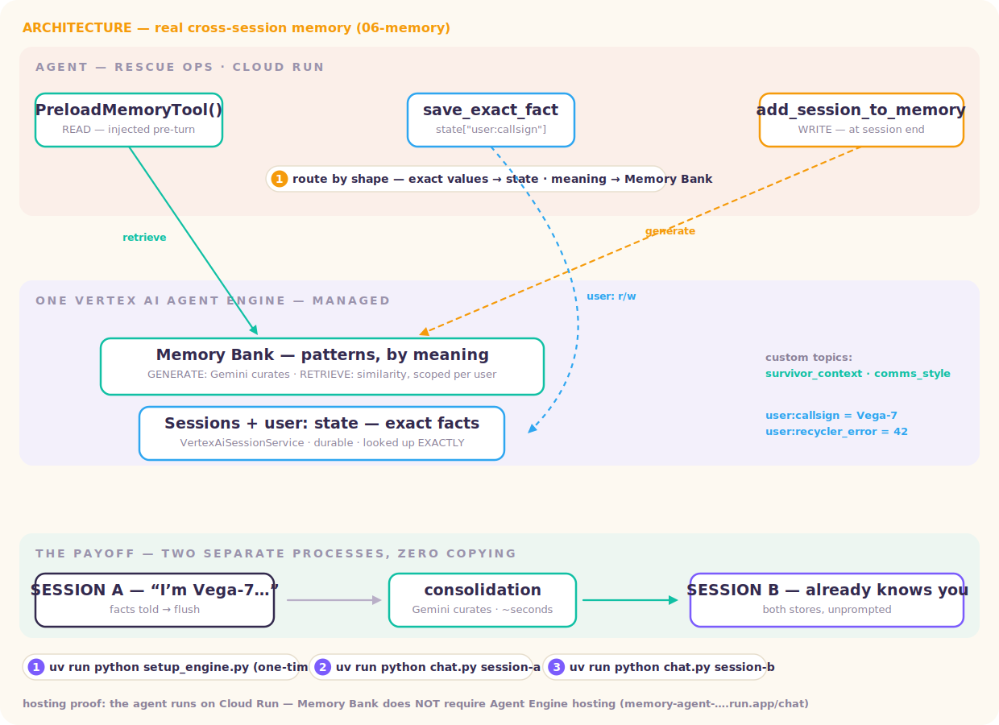

# Level 6 · Recall — real cross-session memory

> You save the session… you open a brand-new one… **and it already knows you.**



Real ADK + **Vertex AI Agent Engine** integration — no mocks. One Agent Engine instance backs both kinds of long-term memory (the "two kinds of knowing"):

| Kind | Example | Where it lives | How it's found |
|---|---|---|---|
| **Exact fact** — a value you look up | callsign `Vega-7`, error code `42` | durable `user:` state · `VertexAiSessionService` | exact match — you want *your* value, not something *similar* |
| **Pattern** — meaning built over time | "long checklists overwhelm me" | **Memory Bank** · `VertexAiMemoryBankService` | similarity — recalled by what it *means* |

| File | What it is |
|---|---|
| [`setup_engine.py`](setup_engine.py) | creates/reuses the Agent Engine — with **custom memory topics** (`survivor_context`, `comms_style`) + managed topics |
| [`agent/agent.py`](agent/agent.py) | the agent: `PreloadMemoryTool` (READ) + `save_exact_fact`/`get_exact_facts` (`user:` state) |
| [`chat.py`](chat.py) | the proof: session A → flush → **brand-new** session B recalls everything |

## The loop (talk: "the memory loop")

1. **The session is evidence, not memory.** A transcript is a recording; memory is what you *learn* from it.
2. **WRITE — generate.** `memory_service.add_session_to_memory(session)` hands the conversation to Gemini, which **curates** it: extracts durable facts per topic, merges duplicates, updates stale ones.
3. **READ — retrieve.** `PreloadMemoryTool()` similarity-searches the bank for this `user_id` before the model runs and injects the matches into the prompt.
4. Exact values skip the bank entirely — they're written to `user:` state the moment they're said.

## 🧭 Run it locally — step by step

Part 1 of the tutorial; Part 2 (deploying with memory, both hosts) is the **🚀 Ship it**
section below.

**Step 0 — prerequisites.**

```bash
gcloud auth application-default login       # ADC
cp .env.example .env                        # set GOOGLE_CLOUD_PROJECT (+ location us-central1)
uv sync
```

**Step 1 — provision the memory infrastructure (one-time, ~1 min).**

```bash
uv run python setup_engine.py
```

> **What to expect:** it prints `AGENT_ENGINE_ID=<number>` — **put it in `.env`**. You just
> created the Vertex AI Agent Engine that backs BOTH stores: durable `user:` state (exact
> facts) and Memory Bank (curated patterns), with our custom topics (`survivor_context`,
> `comms_style`). Think "created a database" — every host from here on just points at this id.

**Step 2 — session A: give it something to remember.**

```bash
uv run python chat.py session-a
```

> **What to expect:** chat normally — tell it your callsign, a device error, a preference
> ("long checklists overwhelm me"). On exit the session is flushed to Memory Bank
> (`add_session_to_memory`) and the script polls until the curated memories appear. Watch which
> store each item lands in: exact values → `user:` state, meaning → the bank.

**Step 3 — session B: the proof.**

```bash
uv run python chat.py session-b
```

> **What to expect:** a BRAND-NEW session, zero history copied — ask *"what do you remember
> about me?"* Verified output from a real run:

> *"I know your callsign is **Vega-7**, and your oxygen recycler has been throwing **error code 42** — these are exact facts I have stored. I also remember from our past conversations that you find long checklists overwhelming, so you prefer to be walked through things one step at a time."*

The agent even tells you which store each memory came from — exact facts vs curated patterns. That routing is the whole lesson: **state remembers strings; Memory Bank remembers meaning.**

## 🚀 Ship it — the agent is disposable; the memory is infrastructure

> The deep tutorial behind the **⌁ Launch Bay** in the Way Back Home realm. The deployed
> `memory-agent` service below runs exactly this recipe.

The deployment insight of this level: **Memory Bank lives in Agent Engine, but the agent that
USES it can be hosted anywhere.** Deploying "with memory" is three moves — provision the
engine once, point any host at it, prove a fresh process still remembers.

### Step 1 · PROVISION — create the engine (once, like creating a database)

```bash
cp .env.example .env            # GOOGLE_CLOUD_PROJECT + GOOGLE_CLOUD_LOCATION=us-central1
uv sync
uv run python setup_engine.py
# → prints AGENT_ENGINE_ID=1234567890123456789  → put it in .env
```

This is *infrastructure provisioning*, not deployment — the engine holds both stores
(`VertexAiSessionService` for exact `user:` facts, `VertexAiMemoryBankService` for curated
patterns), configured with our custom topics (`survivor_context`, `comms_style`). Every host
in step 2 points at THIS id. You never run this again unless you want a fresh brain.

### Step 2 · POINT — pick a host and hand it two things

Any host needs exactly two things: the **`AGENT_ENGINE_ID` env var** and **IAM permission to
reach it**. No key files — ADC everywhere.

**Host A — Cloud Run (how the live `memory-agent` service runs).** Your own HTTP surface
([`server.py`](server.py): `/chat` + the explicit `/end` flush), the [`Dockerfile`](Dockerfile)
ships agent + server:

```bash
PROJECT=$(gcloud config get-value project)

gcloud run deploy memory-agent \
  --source . --region us-central1 --allow-unauthenticated \
  --set-env-vars GOOGLE_CLOUD_PROJECT=$PROJECT,GOOGLE_CLOUD_LOCATION=us-central1,AGENT_ENGINE_ID=YOUR_ENGINE_ID

# the service authenticates as its service account — give it Vertex access:
SA=$(gcloud run services describe memory-agent --region us-central1 --format 'value(spec.template.spec.serviceAccountName)')
gcloud projects add-iam-policy-binding $PROJECT --member serviceAccount:$SA --role roles/aiplatform.user
```

Redeploy this service as often as you like — **every instance is disposable**; nothing it
remembers lives inside it. (The public demo service also honors an optional `WORKSHOP_TOKEN`
env — when set, requests need an `X-WBH-Token` header. Leave it unset for your own deploys.)

**Host B — Agent Engine hosts the agent too (least code).** Sessions, memory, AND the runtime
in one managed place:

```bash
uv run adk deploy agent_engine \
  --project $(gcloud config get-value project) \
  --region us-central1 \
  --display_name memory-agent \
  agent
```

Takes 5–10 minutes. Choose B when you don't need a custom HTTP surface; choose A when you want
your own endpoints (like `/end`) or the same host pattern as every other level in this repo.

**Host C — your laptop, pointed at the SAME engine (the stage moment).** `chat.py` session A
on your laptop, then curl the Cloud Run service as the same `user_id` — it recalls what you
told your laptop. Memory ≠ process, demonstrated in one breath.

### Step 3 · PROVE — the deterministic receipt

```bash
curl -X POST https://memory-agent-680476413759.us-central1.run.app/chat \
  -H "Content-Type: application/json" \
  -d '{"user_id":"vega-7","text":"What do you remember about me?"}'
# → recalls the exact facts (user: state) AND the curated patterns (Memory Bank)
```

`POST /end {user_id, session_id}` flushes a finished session to the bank (WRITE = curation:
Gemini extracts durable facts per topic, merges duplicates, updates stale ones).

The kill-test worth doing once: redeploy the service (`gcloud run deploy …` again), then re-run
the curl — **same memories**. The agent process died; the memory didn't. That's the whole
lesson.

### Troubleshooting

| Symptom | Cause → fix |
|---|---|
| `KeyError: AGENT_ENGINE_ID` at startup | step 1 not run, or the env var didn't reach the deploy → check `--set-env-vars` |
| `PERMISSION_DENIED` reaching the engine | the *service account* lacks `roles/aiplatform.user` (step 2A) — your own ADC working locally proves nothing about the service |
| brand-new session remembers nothing | session was never flushed — call `/end` (or rely on the `after_agent_callback` pattern below) |
| exact facts recalled, patterns missing (or vice-versa) | the two stores are separate by design — `user:` state holds values, Memory Bank holds meaning; check which one you wrote to |
| `403` with `X-WBH-Token` errors | the deployed demo has `WORKSHOP_TOKEN` set — send the header, or deploy your own without it |

## Production notes

- A long-running app fires the WRITE in an `after_agent_callback` as a background task instead of an explicit flush ([gca level_2 pattern](https://github.com/gca-americas/way-back-home/tree/main/solutions/level_2)).
- You do **not** have to host the agent inside Agent Engine to use Memory Bank — Cloud Run + `VertexAiMemoryBankService` pointed at the engine works (that's how [FashionMind](https://github.com/cuppibla/fashionmind) runs).
- Live-audio caveat: voice transcripts live in `input/output_transcription`, not `content.parts` — replay them as synthetic events before flushing, or Memory Bank sees an empty session.
