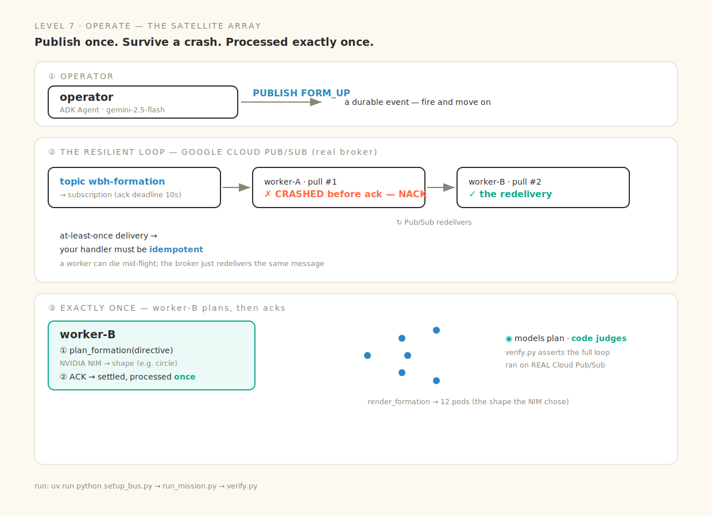

# Level 7 · Operate — the Satellite Array

> Tight calls don't scale. Publish an event to a durable bus, and a crash just means redelivery — the work still runs **exactly once**.



Real, runnable code for every beat of the session (deck: *Way Back Home · D2·S3 — Event-Driven Architectures*). Real **Google Cloud Pub/Sub**; **NVIDIA NIM** plans the formation.

| Slide beat | Code | The one idea |
|---|---|---|
| ① Tight calls don't scale | *(the wall)* | direct request/response couples caller to worker; one slow worker stalls the fleet |
| ② Publish → bus → react | [`bus.py`](bus.py) · `publish` | a durable event on a real topic — fire and move on |
| ③ Survive a crash | `bus.py` · NACK → redeliver | worker-A crashes before ack → Pub/Sub **redelivers** the same message |
| ④ Ack only on success | `bus.py` · `acknowledge` | worker-B plans (NIM) + acks → settled, processed exactly once |
| ⑤ At-least-once → idempotent | *(the contract)* | at-least-once delivery means your handler **must** be idempotent |
| ⑥ Code judges | [`verify.py`](verify.py) | the gate asserts the full publish→crash→redeliver→ack loop on **real** Pub/Sub |

## Run it locally

```bash
cp .env.example .env          # GOOGLE_CLOUD_PROJECT (Vertex/ADC) · NVIDIA_API_KEY
uv sync

uv run python setup_bus.py    # ① create the topic + subscription (one-time, real Cloud Pub/Sub)
uv run python run_mission.py  # the operator publishes → crash → redeliver → plan → ack
uv run python verify.py       # the gate (processed exactly once)

# cleanup:
gcloud pubsub subscriptions delete wbh-formation-sub && gcloud pubsub topics delete wbh-formation
```

## The contract worth memorizing

- **PUBLISH is durable** — the event survives even if every worker is down.
- **NACK** (or a missed ack deadline) → the broker **redelivers**, so a worker can crash mid-flight safely.
- **ACK only on success** → the message settles. Because delivery is **at-least-once**, the handler must be **idempotent** — running it twice must be safe.

Runs on real Cloud Pub/Sub by default; set `PUBSUB_EMULATOR_HOST` + `PUBSUB_PROJECT` for a local emulator instead.
